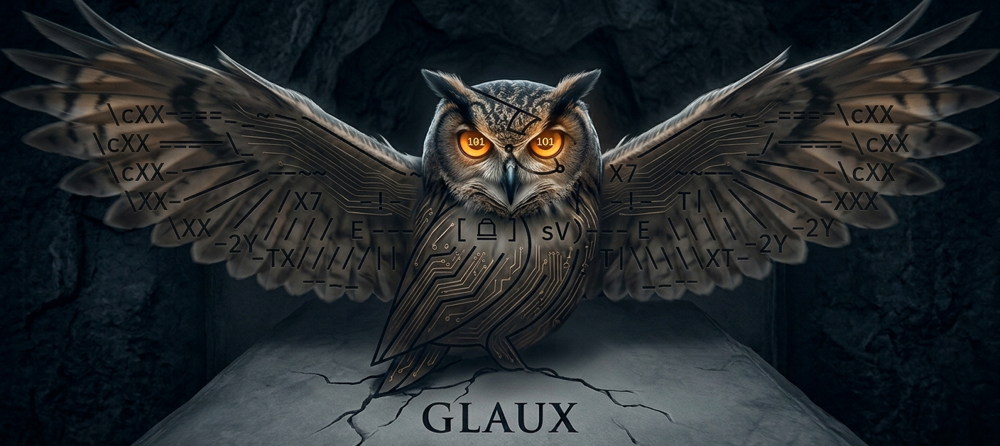

# GLAUX — BMP Steganography Engine

Advanced image steganography with XTEA encryption for Windows.
<p align="center">
  
</p>
## What is Glaux?

Glaux is a command-line tool that lets you hide secret messages inside BMP images. Your message is encrypted using the **XTEA algorithm** (eXtended Tiny Encryption Algorithm) and embedded into the least significant bits (LSB) of the image pixels. To anyone looking, the image appears unchanged.

## Features

- **XTEA Encryption**: 128-bit key, 64 rounds — robust security in minimal code
- **LSB Steganography**: Hides encrypted data in the least significant bits of pixel channels
- **Zero Dependencies**: Self-contained executable, no external libraries needed
- **Multiple Commands**:
  - **Encode**: Encrypt a message and hide it in a BMP image
  - **Decode**: Extract and decrypt a hidden message from a BMP image
  - **Info**: Display detailed information about a BMP file's steganography capacity

## System Requirements

- **Windows XP and newer** (Windows 7, 8, 10, 11, etc.)
- **No installation required** — just download and run
- **No external dependencies** — everything is included in the .exe file

## Installation

1. Download `glaux.exe` from the release
2. Place it in any directory on your computer
3. Optional: Create a shortcut to `glaux.bat` for easy access

## How to Use

### Option 1: Run directly (Recommended)
Double-click `glaux.bat` or run from command prompt:
```
glaux.exe
```

### Option 2: Run from Command Prompt/PowerShell
```powershell
cd C:\Path\To\Glaux
.\glaux.exe
```

### Basic Workflow

#### Step 1: Encode (Hide a message)
1. Run the program: `glaux.exe`
2. Select option **[1] Encode**
3. Provide your BMP image file path (24-bit or 32-bit BMP)
4. Enter your secret message
5. Enter an encryption passphrase (remember this!)
6. Specify output BMP file path
7. The program creates a new BMP file with your hidden message

#### Step 2: Decode (Extract a message)
1. Run the program: `glaux.exe`
2. Select option **[2] Decode**
3. Provide the BMP file containing the hidden message
4. Enter the same passphrase used during encoding
5. Your message appears on screen

#### Step 3: Check Image Capacity
1. Run the program: `glaux.exe`
2. Select option **[3] Info**
3. Provide a BMP file path
4. View the maximum message size the image can hold

## Technical Details

### How It Works

1. **Message Encryption**: Your message is encrypted using XTEA with a 128-bit key derived from your passphrase
2. **Payload Structure**: The encrypted data is prefixed with a 32-bit size header so the decoder knows when to stop
3. **LSB Embedding**: Each bit of the encrypted payload is written to the least significant bit (LSB) of pixel channels
4. **Imperceptibility**: Since only the LSB is modified, the image appears visually unchanged to the human eye

### Capacity

A 1920×1080 24-bit BMP image can hide approximately **764 KB** of raw data (before encryption).

The actual usable capacity depends on:
- Image dimensions
- Color depth (24-bit or 32-bit)
- Overhead: 4 bytes for the size header

## Advanced Usage

### Command-Line from Batch Script
Create a .bat file to automate encoding/decoding:

```batch
@echo off
chcp 65001 >nul
glaux.exe
```

## Troubleshooting

### "File not found" error
- Ensure your BMP file path is correct
- Use full paths: `C:\Users\YourName\Pictures\image.bmp`
- File must exist and be readable

### "Invalid BMP file" error
- The file must be a BMP image (not JPEG, PNG, etc.)
- Only 24-bit and 32-bit BMP formats are supported
- Check that the file isn't corrupted

### Message won't decrypt with "Wrong key or corrupted data"
- Double-check your passphrase (it's case-sensitive)
- Ensure you're using the correct BMP file
- The file may have been modified after encoding

### Characters appear corrupted in console
- Right-click console > Properties > Font: Change to "Consolas" or "Courier New"
- Ensure Windows has the latest console updates

## Security Notes

⚠️ **Important**: This tool provides **security through obscurity** combined with encryption:
- The XTEA cipher is cryptographically sound but relatively simple
- For highly sensitive data, consider combining with additional encryption
- The passphrase strength directly impacts security
- Use strong, unique passphrases (12+ characters recommended)

## Source Code

The full C++ source code is available. The program:
- Uses Windows API for console output only
- Is written in C++17 for modern language features
- Implements XTEA in under 50 lines of code
- Contains extensive comments explaining each section

## Licensing

Glaux is provided as-is for educational and personal use.

## Support

For issues, questions, or feature requests, check that:
1. Your BMP file format is correct (use Paint or Photoshop to verify)
2. Your passphrase is entered exactly as you set it
3. You're using the latest version of Glaux
4. Your Windows installation is up to date

## Version

**Glaux v1.0.0** — BMP Steganography Engine

---

**Happy hiding!** 🦉
